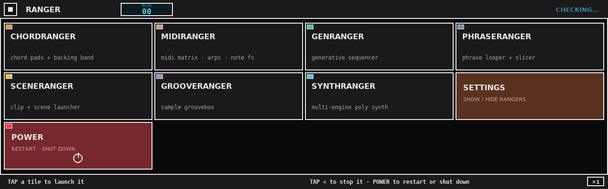
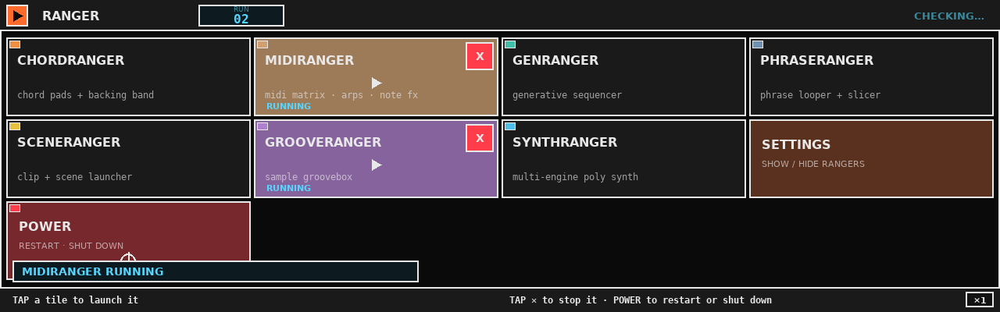
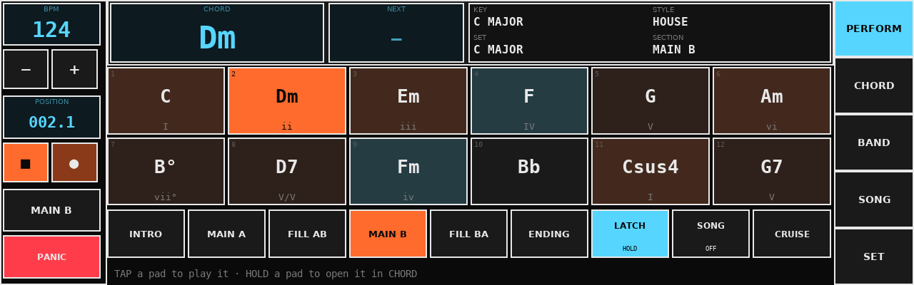
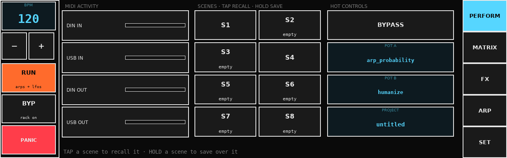
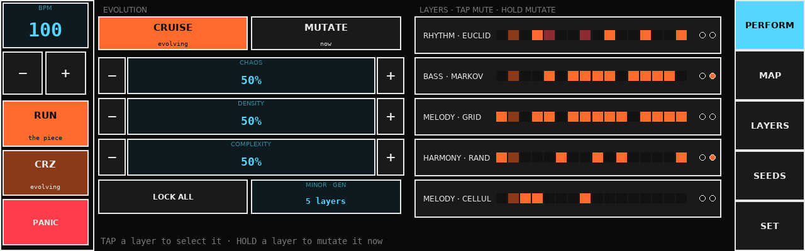
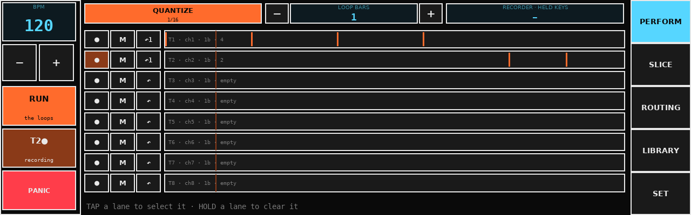
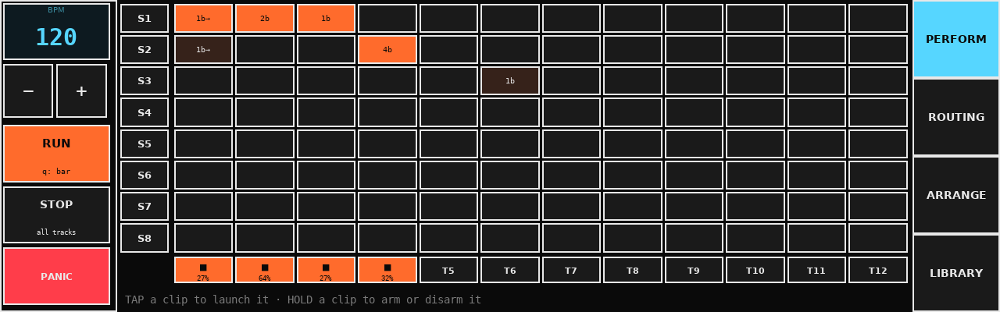
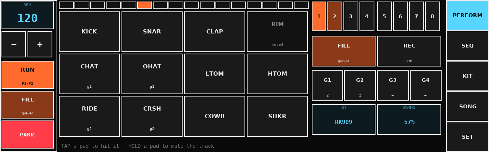
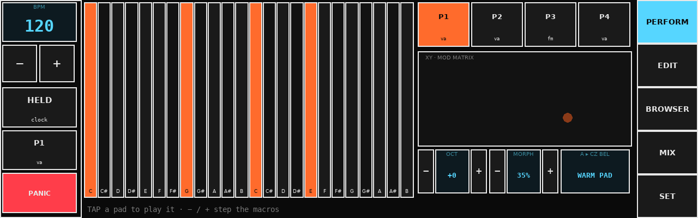

# pi-gen

Tool used to create Raspberry Pi OS images. (Previously known as Raspbian).


## Dependencies

pi-gen runs on Debian-based operating systems. Currently it is only supported on
either Debian Buster or Ubuntu Xenial and is known to have issues building on
earlier releases of these systems. On other Linux distributions it may be possible
to use the Docker build described below.

To install the required dependencies for `pi-gen` you should run:

```bash
apt-get install coreutils quilt parted qemu-user-static debootstrap zerofree zip \
dosfstools libarchive-tools libcap2-bin grep rsync xz-utils file git curl bc \
qemu-utils kpartx gpg pigz
```

The file `depends` contains a list of tools needed.  The format of this
package is `<tool>[:<debian-package>]`.

## Getting started with building your images

Getting started is as simple as cloning this repository on your build machine. You
can do so with:

```bash
git clone https://github.com/RPI-Distro/pi-gen.git
```

`--depth 1` can be added afer `git clone` to create a shallow clone, only containing
the latest revision of the repository. Do not do this on your development machine.

Also, be careful to clone the repository to a base path **NOT** containing spaces.
This configuration is not supported by debootstrap and will lead to `pi-gen` not
running.

After cloning the repository, you can move to the next step and start configuring
your build.

## Config

Upon execution, `build.sh` will source the file `config` in the current
working directory.  This bash shell fragment is intended to set needed
environment variables.

The following environment variables are supported:

 * `IMG_NAME` **required** (Default: unset)

   The name of the image to build with the current stage directories.  Setting
   `IMG_NAME=Raspbian` is logical for an unmodified RPi-Distro/pi-gen build,
   but you should use something else for a customized version.  Export files
   in stages may add suffixes to `IMG_NAME`.

 * `PI_GEN_RELEASE` (Default: `Raspberry Pi reference`)

   The release name to use in `/etc/issue.txt`. The default should only be used
   for official Raspberry Pi builds.

* `USE_QCOW2` **EXPERIMENTAL** (Default: `0` )

    Instead of using traditional way of building the rootfs of every stage in
    single subdirectories and copying over the previous one to the next one,
    qcow2 based virtual disks with backing images are used in every stage.
    This speeds up the build process and reduces overall space consumption
    significantly.

    <u>Additional optional parameters regarding qcow2 build:</u>

    * `BASE_QCOW2_SIZE` (Default: 12G)

        Size of the virtual qcow2 disk.
        Note: it will not actually use that much of space at once but defines the
        maximum size of the virtual disk. If you change the build process by adding
        a lot of bigger packages or additional build stages, it can be necessary to
        increase the value because the virtual disk can run out of space like a normal
        hard drive would.

    **CAUTION:**  Although the qcow2 build mechanism will run fine inside Docker, it can happen
    that the network block device is not disconnected correctly after the Docker process has
    ended abnormally. In that case see [Disconnect an image if something went wrong](#Disconnect-an-image-if-something-went-wrong)

* `RELEASE` (Default: bookworm)

   The release version to build images against. Valid values are any supported
   Debian release. However, since different releases will have different sets of
   packages available, you'll need to either modify your stages accordingly, or
   checkout the appropriate branch. For example, if you'd like to build a
   `buster` image, you should do so from the `buster` branch.

 * `APT_PROXY` (Default: unset)

   If you require the use of an apt proxy, set it here.  This proxy setting
   will not be included in the image, making it safe to use an `apt-cacher` or
   similar package for development.

   If you have Docker installed, you can set up a local apt caching proxy to
   like speed up subsequent builds like this:

       docker-compose up -d
       echo 'APT_PROXY=http://172.17.0.1:3142' >> config

 * `BASE_DIR`  (Default: location of `build.sh`)

   **CAUTION**: Currently, changing this value will probably break build.sh

   Top-level directory for `pi-gen`.  Contains stage directories, build
   scripts, and by default both work and deployment directories.

 * `WORK_DIR`  (Default: `"$BASE_DIR/work"`)

   Directory in which `pi-gen` builds the target system.  This value can be
   changed if you have a suitably large, fast storage location for stages to
   be built and cached.  Note, `WORK_DIR` stores a complete copy of the target
   system for each build stage, amounting to tens of gigabytes in the case of
   Raspbian.

   **CAUTION**: If your working directory is on an NTFS partition you probably won't be able to build: make sure this is a proper Linux filesystem.

 * `DEPLOY_DIR`  (Default: `"$BASE_DIR/deploy"`)

   Output directory for target system images and NOOBS bundles.

 * `DEPLOY_COMPRESSION` (Default: `zip`)

   Set to:
   * `none` to deploy the actual image (`.img`).
   * `zip` to deploy a zipped image (`.zip`).
   * `gz` to deploy a gzipped image (`.img.gz`).
   * `xz` to deploy a xzipped image (`.img.xz`).


 * `DEPLOY_ZIP` (Deprecated)

   This option has been deprecated in favor of `DEPLOY_COMPRESSION`.

   If `DEPLOY_ZIP=0` is still present in your config file, the behavior is the
   same as with `DEPLOY_COMPRESSION=none`.

 * `COMPRESSION_LEVEL` (Default: `6`)

   Compression level to be used when using `zip`, `gz` or `xz` for
   `DEPLOY_COMPRESSION`. From 0 to 9 (refer to the tool man page for more
   information on this. Usually 0 is no compression but very fast, up to 9 with
   the best compression but very slow ).

 * `USE_QEMU` (Default: `"0"`)

   Setting to '1' enables the QEMU mode - creating an image that can be mounted via QEMU for an emulated
   environment. These images include "-qemu" in the image file name.

 * `LOCALE_DEFAULT` (Default: "en_GB.UTF-8" )

   Default system locale.

 * `TARGET_HOSTNAME` (Default: "raspberrypi" )

   Setting the hostname to the specified value.

 * `KEYBOARD_KEYMAP` (Default: "gb" )

   Default keyboard keymap.

   To get the current value from a running system, run `debconf-show
   keyboard-configuration` and look at the
   `keyboard-configuration/xkb-keymap` value.

 * `KEYBOARD_LAYOUT` (Default: "English (UK)" )

   Default keyboard layout.

   To get the current value from a running system, run `debconf-show
   keyboard-configuration` and look at the
   `keyboard-configuration/variant` value.

 * `TIMEZONE_DEFAULT` (Default: "Europe/London" )

   Default keyboard layout.

   To get the current value from a running system, look in
   `/etc/timezone`.

 * `FIRST_USER_NAME` (Default: `pi`)

   Username for the first user. This user only exists during the image creation process. Unless
   `DISABLE_FIRST_BOOT_USER_RENAME` is set to `1`, this user will be renamed on the first boot with
   a name chosen by the final user. This security feature is designed to prevent shipping images
   with a default username and help prevent malicious actors from taking over your devices.

 * `FIRST_USER_PASS` (Default: unset)

   Password for the first user. If unset, the account is locked.

 * `DISABLE_FIRST_BOOT_USER_RENAME` (Default: `0`)

   Disable the renaming of the first user during the first boot. This make it so `FIRST_USER_NAME`
   stays activated. `FIRST_USER_PASS` must be set for this to work. Please be aware of the implied
   security risk of defining a default username and password for your devices.

 * `WPA_COUNTRY` (Default: unset)

   Sets the default WLAN regulatory domain and unblocks WLAN interfaces. This should be a 2-letter ISO/IEC 3166 country Code, i.e. `US` or `GB`. **Required** on modern Pi OS for the radio to leave rfkill.

 * `WPA_ESSID` / `WPA_PASSWORD` (Default: unset)

   Pre-join a WiFi network at first boot (written into NetworkManager +
   `wpa_supplicant.conf`). Put secrets in **`config.local`** (gitignored;
   see `config.local.example`), or pass on the build command line:

   ```bash
   WPA_COUNTRY=US WPA_ESSID='MyNet' WPA_PASSWORD='secret' ./build-docker.sh
   ```

   When `WPA_ESSID` is set, `ENABLE_WIFI_HOTSPOT` defaults to **0** so the
   radio can join your AP instead of starting the Patchbox hotspot (set
   `FORCE_WIFI_HOTSPOT=1` to keep both behaviors you opt into explicitly).

 * `ENABLE_SSH` (Default: `0`)

   Setting to `1` will enable ssh server for remote log in. Note that if you are using a common password such as the defaults there is a high risk of attackers taking over you Raspberry Pi.

  * `PUBKEY_SSH_FIRST_USER` (Default: unset)

   Setting this to a value will make that value the contents of the FIRST_USER_NAME's ~/.ssh/authorized_keys.  Obviously the value should
   therefore be a valid authorized_keys file.  Note that this does not
   automatically enable SSH.

  * `PUBKEY_ONLY_SSH` (Default: `0`)

   * Setting to `1` will disable password authentication for SSH and enable
   public key authentication.  Note that if SSH is not enabled this will take
   effect when SSH becomes enabled.

 * `SETFCAP` (Default: unset)

   * Setting to `1` will prevent pi-gen from dropping the "capabilities"
   feature. Generating the root filesystem with capabilities enabled and running
   it from a filesystem that does not support capabilities (like NFS) can cause
   issues. Only enable this if you understand what it is.

 * `ENABLE_WIFI_HOTSPOT` (Default: `1`)

   Enable the `wifi-hotspot` service (Patchbox's default headless-onboarding AP) at boot.
   Set to `0` for a performance-focused build with the radio off by default.

 * `ENABLE_VNC` (Default: `1`)

   Enable the RealVNC server at boot. Set to `0` to keep it installed but disabled by
   default (reduces background CPU/network load and remote-access attack surface).

 * `ENABLE_TELEMETRY` (Default: `1`)

   Enable the `blokas-telemetry` service at boot. Set to `0` to keep the package
   installed but the service disabled by default.

 * `PISOUND_GIT_REF` (Default: `patchbox`)

   Git ref checked out for `/usr/local/pisound` during the build (stage3/02-install-pisound).
   Defaults to the moving `patchbox` branch; set to a tag or commit SHA for
   reproducible builds.

 * `HOTSPOT_PASSPHRASE` (Default: `blokaslabs`)

   WPA2 passphrase for the default WiFi hotspot. Override for hardened/production
   builds; the default matches Patchbox's documented onboarding passphrase.

 * `ENABLE_FIRST_LOGIN_PASSWORD_CHANGE` (Default: `1`)

   Force a password change at first login for `FIRST_USER_NAME`, since
   `FIRST_USER_PASS` is a well-known default. Set to `0` to restore the
   previous unforced behavior.

 * `ENABLE_WAVESHARE_DPI` (Default: `0`)

   Configure **Waveshare 3.5″ DPI LCD** (640×480 IPS capacitive, 40-pin) —
   Profile C. Installs vendor DTBO overlays, `dtoverlay=waveshare-35dpi` +
   `waveshare-touch-35dpi`, libinput touch rules, and LightDM no-blank.
   Use `config.waveshare35-pimidi` for the full bake (panel + Pimidi).
   **`WAVESHARE_KEEP_PIMIDI=1`** keeps `dtoverlay=pimidi` under the panel
   (experimental — pinmux can fight). **Conflicts with Inky / RaspiAudio /
   HyperPixel** on the same header.

 * `ENABLE_INKY` (Default: `0`)

   Install support for the Pimoroni Inky Impression e-paper HAT (tested with
   the 5.7" 600×448 7-colour Gallery Palette panel on Raspberry Pi 5).
   Installs a system venv at `/opt/pimoroni` with the official `inky` Python
   library, the Patchbox Inky UI package (`patchbox-inky-ui` / splash /
   patchbay / status), and loads `i2c-dev`/`spidev`. SPI + I2C device-tree
   enablement lives in `stage1` `config.txt` and is always applied
   (including `dtoverlay=i2c1-pi5` for Pi 5). Set to `0` to skip the
   Python/service install only.

 * `ENABLE_INKY_UI` (Default: `0`)

   When `1` (and `ENABLE_INKY=1`), enable `patchbox-inky-ui.service` at boot
   (splash + one patchbay frame; navigation prefers keyboard/TUI because
   7-colour e-ink takes ~30s per full refresh). Default **off** — use
   `patchbox-inky-tui` over SSH for interactive patchbay, or a future IPS.

 * `ENABLE_INKY_STATUS_SERVICE` (Default: `0`)

   Legacy oneshot that only paints the status snapshot. Ignored when
   `ENABLE_INKY_UI=1`. Prefer `patchbox-inky-status` on the CLI instead.

 * `ENABLE_RASPIAUDIO` (Default: `1`)

   Configure the image for a **RaspiAudio Mic Ultra++** (or Mic+) I2S HAT as
   the primary sound card under the Inky Impression. Enables `dtparam=i2s=on`,
   disables onboard `dtparam=audio`, and installs `dtoverlay=` from
   `RASPIAUDIO_OVERLAY`. Intended stack: **Pi → RaspiAudio (passthrough) → Inky**.

 * `RASPIAUDIO_OVERLAY` (Default: `wm8960-soundcard`)

   Device-tree overlay for RaspiAudio. Use `wm8960-soundcard` for full WM8960
   mixer control (Ultra++ Method 2 style), or `googlevoicehat-soundcard` for
   RaspiAudio Method 1 / Mic+. Switch after first boot if `aplay -l` shows no
   card.

 * `STAGE_LIST` (Default: `stage*`)

    If set, then instead of working through the numeric stages in order, this list will be followed. For example setting to `"stage0 stage1 mystage stage2"` will run the contents of `mystage` before stage2. Note that quotes are needed around the list. An absolute or relative path can be given for stages outside the pi-gen directory.

A simple example for building Raspbian:

```bash
IMG_NAME='Raspbian'
```

The config file can also be specified on the command line as an argument the `build.sh` or `build-docker.sh` scripts.

```
./build.sh -c myconfig
```

This is parsed after `config` so can be used to override values set there.

## How the build process works

The following process is followed to build images:

 * Loop through all of the stage directories in alphanumeric order

 * Move on to the next directory if this stage directory contains a file called
   "SKIP"

 * Run the script ```prerun.sh``` which is generally just used to copy the build
   directory between stages.

 * In each stage directory loop through each subdirectory and then run each of the
   install scripts it contains, again in alphanumeric order. These need to be named
   with a two digit padded number at the beginning.
   There are a number of different files and directories which can be used to
   control different parts of the build process:

     - **00-run.sh** - A unix shell script. Needs to be made executable for it to run.

     - **00-run-chroot.sh** - A unix shell script which will be run in the chroot
       of the image build directory. Needs to be made executable for it to run.

     - **00-debconf** - Contents of this file are passed to debconf-set-selections
       to configure things like locale, etc.

     - **00-packages** - A list of packages to install. Can have more than one, space
       separated, per line.

     - **00-packages-nr** - As 00-packages, except these will be installed using
       the ```--no-install-recommends -y``` parameters to apt-get.

     - **00-patches** - A directory containing patch files to be applied, using quilt.
       If a file named 'EDIT' is present in the directory, the build process will
       be interrupted with a bash session, allowing an opportunity to create/revise
       the patches.

  * If the stage directory contains files called "EXPORT_NOOBS" or "EXPORT_IMAGE" then
    add this stage to a list of images to generate

  * Generate the images for any stages that have specified them

It is recommended to examine build.sh for finer details.


## Patchbox OS: audio/MIDI latency & security tuning

This fork bakes in a set of low-latency-audio defaults on top of upstream pi-gen:

 * `threadirqs`, `audit=0`, `usbcore.autosuspend=-1` on the kernel cmdline
   (`stage1/00-boot-files/files/cmdline.txt`).
 * `disable_splash=1`, `initial_turbo=60` in `config.txt`
   (`stage1/00-boot-files/files/config.txt`); `force_turbo=1` is present but
   commented out — enable it only if you still see clock-transition xruns
   after the above (raises heat/power draw, and must not be combined with
   `over_voltage`).
 * Explicit `@audio` realtime limits (`rtprio 95`, `memlock unlimited`,
   `nice -19`) in `/etc/security/limits.d/95-patchbox-audio.conf`
   (`stage3/03-install-jack`), in addition to jackd2's own debconf-driven limits.
 * `vm.swappiness=10` and reduced dirty-writeback ratios via
   `/etc/sysctl.d/90-patchbox-audio.conf` (`stage3/02-install-pisound`). Swap
   itself (`dphys-swapfile`, 100 MB) stays enabled as an OOM safety net for
   512 MB boards — set `CONF_SWAPSIZE=0` in `/etc/dphys-swapfile` post-build
   if you want it off entirely.
 * The `performance` cpufreq governor is now applied to every cpufreq
   policy, not just `cpu0` (`stage3/02-install-pisound/files/cpu_performance_scaling_governor.service`).
 * A boot-time pass raises the scheduling priority of audio/USB IRQ kernel
   threads (`patchbox-irq-priorities.service`/`.sh`), pairing with
   `threadirqs`. Note this only catches interrupts that already exist at
   boot (onboard audio, Pisound); a hot-plugged USB audio interface's IRQ
   thread is not automatically re-prioritized after the fact — re-run
   `/usr/local/sbin/patchbox-irq-priorities.sh` manually or via udev if you
   need that.

**Not enabled by default, for later/opt-in tuning:**

 * **CPU isolation** (`isolcpus=3 nohz_full=3 rcu_nocbs=3` + `taskset`/`chrt`
   pinning your DSP process to the isolated core) — biggest worst-case-latency
   win on 4-core boards, but steals a core from Pd/SuperCollider/JACK's own
   multi-threading, so it's a manual `cmdline.txt` edit, not a default.
 * **PREEMPT_RT kernel** — set `RT_KERNEL_VERSION` to an available RT kernel
   package name (verify with `apt-cache policy <name>` in a chroot first;
   none is currently pinned in this repo) and `stage3/05-rt-kernel` will
   install it. Off by default: better worst-case latency, but real
   driver-compatibility and thermal/throughput risk, and the tuning above
   already gets most of the win on the stock kernel.

### Primary stack: Pisound + HDMI 1280×400 + RK-00pi

```text
Pi 5 + Pisound (40-pin: 1/4" I/O, MIDI DIN, The Button)
    + HDMI bar monitor 1280×400 + USB touch
    + RK-00pi kiosk (main appliance — sequencer / MIDI hub)
```

**Main app** is the git submodule [`RK-00pi`](https://github.com/johnnyclem/RK-00pi)
(`git@github.com:johnnyclem/RK-00pi.git`), installed by `stage3/10-install-rk00pi`
into `/opt/rk00pi` with `rk00pi.service` (SDL `kmsdrm`, multi-user boot).
The same stage maps **The Button** (`pisound-btn` → `/run/rk00pi/button.sock`):
single press toggles transport, double-click records, ~1 s hold saves, ~5 s hold panics.
Rebind under `/etc/rk00pi/config.toml` `[button.map]`; skip with `ENABLE_RK00PI_BUTTON=0`.

```bash
git submodule update --init --recursive
```

Display mode is forced via `hdmi_cvt` / `hdmi_mode=87` and cmdline
`video=HDMI-A-1:1280x400@60D` (`stage3/09-hdmi-ultrawide`). Override with
`HDMI_WIDTH` / `HDMI_HEIGHT` / `HDMI_REFRESH`. For the Waveshare 7.9" panel
use Profile D below (exact `hdmi_timings` + `rotate=90`) instead of generic CVT.

This is also the hardware [the Ranger Suite](#the-ranger-suite) is drawn for.
Same rig, different boot app: `./build-docker.sh -c config.rangers` boots
RangerDeck instead of RK-00pi, and the whole family of apps ships on the card.

### Alternate stack: HyperPixel 4.0" DPI (Profile B)

```text
Pi 5 + Pimoroni HyperPixel 4.0" rectangular (owns 40-pin)
    + 800×480 @ 60 DPI  (dtoverlay=vc4-kms-dpi-hyperpixel4,rotate=270)
    + USB MIDI (Pimidi DT overlay is stripped — GPIO clash)
    + RK-00pi kiosk at 800×480
```

**Build command (required):**

```bash
./build-docker.sh -c config.hyperpixel4-pimidi
# bare path also works:  ./build-docker.sh config.hyperpixel4-pimidi
```

Plain `./build-docker.sh` is Profile A (HDMI). That image has **no** HyperPixel
overlay — the glass stays black (backlight may flash once). Keep WiFi secrets
in `config.local`; do not put HDMI geometry there if you also build HyperPixel
images.

Field fix for an already-flashed HDMI image on a HyperPixel unit:

```bash
./scripts/fix-hyperpixel4-bootfs.sh /Volumes/bootfs   # SD in Mac
# or on the Pi:  sudo patchbox-fix-hyperpixel4 && sudo reboot
```

### Alternate stack: Waveshare 3.5″ DPI + Pimidi (Profile C)

```text
Pi + Blokas Pimidi (40-pin) — 2×2 TRS MIDI
    └── Waveshare 3.5inch DPI LCD (640×480 IPS, Goodix touch)
    + RK-00pi kiosk at 640×480
```

**Build command:**

```bash
./build-docker.sh -c config.waveshare35-pimidi
```

Stacking Pimidi under a full-GPIO DPI panel is **experimental**
(`WAVESHARE_KEEP_PIMIDI=1`). If the panel stays black or touch dies, rebuild
with `WAVESHARE_KEEP_PIMIDI=0` and use USB MIDI, or stay on Profile A / D for
conflict-free TRS. On-device: `~/WAVESHARE-DPI.txt`,
`sudo patchbox-fix-waveshare-dpi`.

### Alternate stack: Waveshare 7.9″ HDMI (Profile D)

```text
Pi 5 + Pimidi (40-pin — free; HDMI does not steal GPIO)
    + Waveshare 7.9inch HDMI LCD
        · native 400×1280 IPS + USB capacitive touch
        · RK-00pi at 400×1280 (portrait chrome — top transport / bottom tabs)
```

Wiki: [7.9inch HDMI LCD](https://www.waveshare.com/wiki/7.9inch_HDMI_LCD)

**Build command:**

```bash
./build-docker.sh -c config.waveshare79-hdmi
```

Stage `09-hdmi-ultrawide` writes the vendor mode line (not `hdmi_cvt`):

```text
hdmi_group=2
hdmi_mode=87
hdmi_timings=400 0 70 10 60 1280 0 20 10 12 0 0 0 60 0 43000000 3
# cmdline (no rotate — see below):
video=HDMI-A-1:400x1280M@60
```

**Landscape without kernel rotate:** DRM stays **400×1280** (stable under
kmsdrm). RK-00pi uses `[display] width=1280 height=400 rotation=90` and
software-rotates the finished frame (`gui/orient.py`). Kernel
`video=…,rotate=90` is still avoided — it caused three wrapped strips then black.

Field-fix a live card (mount boot + root if possible):

```bash
./scripts/fix-waveshare79-bootfs.sh /Volumes/bootfs /Volumes/rootfs
# then reboot; if upside-down: rotation = 270 in /etc/rk00pi/config.toml
```

Hardware: HDMI + USB touch both required; at high brightness feed 5V/2A into
the panel Power jack if the Pi USB port browns out. Rear **Rotate Touch**
button if axes feel wrong.

Parked / opt-in: Inky e-paper, RaspiAudio I2S — each conflicts with Pisound
and/or the chosen UI.

### Audio / MIDI (this release)

| Path | Status |
|------|--------|
| **Pisound** | **Primary** (¼″ + MIDI DIN, JACK) |
| **RK-00pi** | **Primary UI** (ALSA MIDI backend, prefer Pisound) |
| **Ranger Suite** | Shipped, one app at a time — see [The Ranger Suite](#the-ranger-suite) |
| USB audio / USB MIDI | Optional secondary |
| RaspiAudio I2S | Off |
| Pimidi | Ordered / optional later if pins free |

RK-00pi's hub endpoints bind to ALSA ports by **name**, which is what makes
hotplug work and what makes a mismatched image go silent: build for one HAT,
boot on a rig with the other, and every DIN endpoint asks for a client that
is not there. Everything still enumerates — the DIAGNOSTICS screen lists the
devices — and no note or clock moves. `rk00pi.service` therefore re-fits the
hub to the live graph before each start, USB MIDI devices included. Check it
on the unit with `patchbox-rk00pi-autohub` (read-only) and repair with
`sudo patchbox-rk00pi-autohub --apply && sudo systemctl restart rk00pi`.

### Build toggles (display + main app)

| Variable | Default | Meaning |
|----------|---------|---------|
| `ENABLE_RK00PI` | `1` | Install RK-00pi from submodule |
| `ENABLE_RK00PI_SERVICE` | `1` | Enable kiosk unit at boot |
| `ENABLE_RK00PI_BUTTON` | `0` | Wire PiSound Button → RK-00pi gestures |
| `ENABLE_RK00PI_AUTOHUB` | `1` | Fit the MIDI hub to the live ALSA graph at every start |
| `ENABLE_RK00PI_COMPANION` | `1` | LAN companion routing UI + backup (`:8787`, token auth) |
| `RK00PI_COMPANION_BIND` / `PORT` / `ADVERTISE` | `0.0.0.0` / `8787` / `1` | Companion listen + mDNS |
| `RK00PI_HUB_PRESET` | follows `ENABLE_PIMIDI` | Starter hub: `pimidi-2x2`, else `rk008` (Pisound DIN) |
| `RANGER_BOOT_APP` | `rk00pi` | Which kiosk app boots — any Ranger app, or `rangerdeck` for the launcher. Anything but `rk00pi` disables `rk00pi.service` |
| `ENABLE_RANGERDECK` | `1` | Install [RangerDeck](apps/rangerdeck/README.md), the suite launcher |
| `ENABLE_CHORDRANGER` | `1` | Install ChordRanger from `apps/chordranger` |
| `ENABLE_CHORDRANGER_SERVICE` | `0` | Boot ChordRanger instead of RK-00pi |
| `ENABLE_HDMI_ULTRAWIDE` | `1` | HDMI bar + USB touch (Profile A default; Profile D also uses this) |
| `HDMI_WIDTH` / `HEIGHT` / `REFRESH` | 1280 / 400 / 60 | **App-facing** geometry (after any rotate) |
| `HDMI_TIMINGS` | empty | When set (Profile D), write wiki `hdmi_timings=` instead of `hdmi_cvt` |
| `HDMI_NATIVE_WIDTH` / `HEIGHT` | empty → same as app | Kernel mode size before rotate (400×1280 on 7.9") |
| `HDMI_ROTATE` | empty | `90` / `180` / `270` for `video=…,rotate=` (Profile D = 90) |
| `HDMI_CONNECTOR` | `HDMI-A-1` | KMS connector name |
| `ENABLE_HYPERPIXEL4` | `0` | Pimoroni HyperPixel 4 DPI (Profile B — parked) |
| `HYPERPIXEL_WIDTH` / `HEIGHT` / `ROTATE` | 800 / 480 / left | DPI geometry + landscape rotation |
| `ENABLE_WAVESHARE_DPI` | `0` | Waveshare 3.5 DPI (Profile C — `config.waveshare35-pimidi`) |
| `WAVESHARE_WIDTH` / `HEIGHT` / `KEEP_PIMIDI` | 640 / 480 / 0 | Panel geometry + experimental Pimidi under DPI |
| `ENABLE_INKY` | `0` | E-paper software |
| `ENABLE_RASPIAUDIO` | `0` | I2S audio HAT |

### Security notes

A handful of shipped defaults are deliberate product choices for a
headless/appliance-style device (default `patch`/`blokaslabs` credentials
with first-boot user-rename disabled via `export-image/01-user-rename/SKIP`,
passwordless sudo for `patch`, `Xwrapper` `allowed_users=anybody` to allow
`startx` over SSH). These are **not** changed by default in this pass, but
are now parameterized/hardenable:

 * `ENABLE_FIRST_LOGIN_PASSWORD_CHANGE=1` (default) forces a password
   change at first login given the well-known default password.
 * `PUBKEY_ONLY_SSH=1` + `PUBKEY_SSH_FIRST_USER=<your key>` disables SSH
   password auth (upstream pi-gen feature, already available).
 * `HOTSPOT_PASSPHRASE` lets you set a non-default WiFi passphrase per build.
 * `ENABLE_VNC=0` / `ENABLE_TELEMETRY=0` / `ENABLE_WIFI_HOTSPOT=0` disable
   those services outright.
 * Delete `export-image/01-user-rename/SKIP` to restore the standard
   Raspberry Pi OS first-boot user-rename wizard.

Two fixes with no product-behavior change: the transient `root:root` password
previously set in `stage1/01-sys-tweaks` (and always locked again at
`export-image/05-finalise`) has been removed, and the Blokas/Raspberry Pi
Foundation apt repositories now use HTTPS instead of HTTP (both endpoints
verified to serve HTTPS; GPG-signature verification applied either way).

## The Ranger Suite

Seven touch-panel instruments and a launcher, all living in this repo under
[`apps/`](apps) rather than in a submodule, all drawn for the same 1280×400
bar, each baked into the image by its own `stage3` stage.

**After flash — same ease as MODEP:**

```bash
ssh patch@patchbox.local
sudo patchbox-setup wizard          # display · MIDI · tiles · boot app
# or:  patchbox module activate rangerdeck | rk00pi | modep
```

See `~/SETUP.txt` on the image and `stage3/22-install-setup`.

[**RangerDeck**](apps/rangerdeck/README.md) is the front door: one tile per
installed app, tap a tile and that app takes the panel. **SETTINGS** toggles
which Rangers appear (also `patchbox-setup rangers …`).



The tile's ✕ hands the panel back, and **closing the picture never stops the
music** — a backgrounded app keeps its own process, clock, transport, arps,
recording and playback running, and its tile says ▶ RUNNING until you press
the tile's ■ to shut that rig down for real.



| App | What it is | Stage | Toggle |
|-----|------------|-------|--------|
| [ChordRanger](apps/chordranger/README.md) | Chord pads + QY-style backing band | `13` | `ENABLE_CHORDRANGER` |
| [MidiRanger](apps/midiranger/README.md) | MIDI routing matrix · arps · note FX | `15` | `ENABLE_MIDIRANGER` |
| [GenRanger](apps/genranger/README.md) | Generative sequencer (Euclid/Markov/CA, Cruise) | `16` | `ENABLE_GENRANGER` |
| [PhraseRanger](apps/phraseranger/README.md) | MIDI phrase looper + overdub + slicer | `17` | `ENABLE_PHRASERANGER` |
| [SceneRanger](apps/sceneranger/README.md) | 12×8 clip + scene launcher | `18` | `ENABLE_SCENERANGER` |
| [GrooveRanger](apps/grooveranger/README.md) | Sample groovebox + step sequencer + FX | `19` | `ENABLE_GROOVERANGER` |
| [SynthRanger](apps/synthranger/README.md) | Multi-engine multitimbral poly synth | `20` | `ENABLE_SYNTHRANGER` |
| [RangerDeck](apps/rangerdeck/README.md) | The launcher (tiles, handover, updates, POWER) | `21` | `ENABLE_RANGERDECK` |

[`apps/rangerkit`](apps/rangerkit/docs/CONVENTIONS.md) is the shared library
underneath them — theory, clock, routing, engine base, MIDI/pots/button I/O,
the audio path, and the GUI theme and widgets. It is **vendored, not
installed**: each app's stage rsyncs a frozen copy into `/opt/<app>/rangerkit`,
so one app can be updated or rolled back without moving the ground under its
siblings. `stage3/14-install-rangerkit` ships only what is genuinely global,
the `patchbox-app` switcher below.

### The panels

Every screenshot here is generated from the real app, headless, by
`python bench/render_panel.py docs/img` in each app directory — that is how
the panels get reviewed without the hardware on the desk. Each app's README
carries the rest of its screens.

**ChordRanger** — twelve chord pads (Chordcat), a six-section
auto-accompaniment with fills that fire on the bar line (Yamaha QY), and a
bass engine with its own voicing dial independent of the chord part
(Orchid ORC-1):



**MidiRanger** — the suite's MIDI brain: multi-port matrix, four arps, scale
quantizer and harmonizer, note FX, CC LFOs, eight morphable scenes:



**GenRanger** — up to six layers driven by Euclid, Markov, probability grids,
cellular automata or constrained random, with Cruise slowly mutating the piece
and lock regions holding what works:



**PhraseRanger** — eight-track phrase looper with pedal feel: quantized or free
record, tape-style overdub decay, sixteen undos per track, reverse, stretch,
and a slicer that maps a take onto sixteen pads in one gesture:



**SceneRanger** — a 12-track × 8-scene clip grid built for the bar: quantized
launch, follow actions with probability, scene rows that launch as states:



**GrooveRanger** — twelve velocity-layered pads with choke groups, a sixteen-step
sequencer with probability, ratchets, trig conditions, micro-timing and
parameter locks, eight patterns with queued switching and one-pass fills:



**SynthRanger** — four oscillator engines (virtual analog, 2-op FM, wavetable
scan, phase distortion) across four parts, mod matrix fed by an on-screen XY
pad, A ↔ B patch morph on one knob:



### Design system: the micro-rangers industrial language

All eight panels above are drawn from one set of tokens in
[`apps/rangerkit/gui/theme.py`](apps/rangerkit/gui/theme.py) and one set of
components in [`gui/widgets.py`](apps/rangerkit/gui/widgets.py), implementing
the design system of record at
[`docs/design/UI-UX-SPEC.md`](docs/design/UI-UX-SPEC.md). That spec is this
repo's copy of the micro-rangers master sheet: the *language* is inherited in
full, the 320×240 layouts are not. (ChordRanger predates rangerkit and keeps
its own engine, but its `gui/theme.py` and `gui/widgets.py` are now re-export
shims onto the shared ones, so it moves with the family.)

 * **Colour is state, and each hue has exactly one job.** Orange `#FF6B2C` is
   playing (dimmed: armed), cyan `#56D6FF` is selection, active routes and
   every value in a well, green `#3DFF8A` is solo, red `#FF3D4A` is
   stop/delete/panic, yellow `#FFD12A` is warn. A colourway may re-tune a hue
   so it survives its ground; it may not reassign what a hue means.
 * **`RADIUS 0`, 2 px rules, no shadows, no gradients.** Depth is lightness
   and the rule. There is no shadow token and `panel()` does not take the
   keyword, so a stale `shadow=True` is a `TypeError`, not a silent no-op.
 * **Values live in wells** (`bg_lcd` `#0D1A20`), cyan value type over a dim
   cyan caption — the `lcd()`/`param()` widgets. The caption is *permanent*:
   nothing is hovered on a touch panel, so a caption that is not always drawn
   is a caption nobody ever sees. Never pure white on black — it blooms.
 * **Selection is a cyan rule or inverse video** — never a glow, never orange.
   A pad is routinely selected *and* playing, so one must be a fill and the
   other a rule.
 * **Never colour alone for press.** A pressed control takes an inverse fill,
   so the state is legible in sunlight and to a colour-blind eye — and cannot
   be confused with that control being latched.
 * **Mute dims and never hides**; solo is green, and once anything is soloed
   the rest dim, which is the only way to see that a silent track is silent
   *because* of solo.
 * **Type ink is asked for, not assumed.** `ink_for(fill)` picks dark or light
   by luminance, which is what keeps a re-tuned hue or a flipped ground from
   quietly producing unreadable labels.
 * **Colourways are swapped whole, never patched**: `INDUSTRIAL` (default, the
   sheet's palette), `NIGHT`, and `DAYLIGHT` — the light scheme this suite
   shipped with before, kept because its finding stands: a panel with a heavy
   blue cast and a shallow black collapses INDUSTRIAL's three near-black
   surfaces into one washed navy. If that happens on a unit, `theme =
   "daylight"` in the app config is the whole fix. (`mono` and `dusk` were
   folded into `NIGHT` and still resolve.) Nothing in a GUI may capture a
   colour at import time — `theme.apply()` rebinds the names in place, and a
   captured value would keep the old palette forever.

Geometry adapts rather than scales. On the bar, vertical space is the scarce
resource, so the chrome turns sideways — transport rail down the left (150 px),
tab rail down the right (112 px), and the content keeps all 400 px of height.
Portrait and 800×480 panels get the ordinary top-transport / bottom-tabs stack
instead. Three geometries are resolved by one `Layout` class (1280×400,
800×480, 480×800) and the GUI tests run all three. Hit targets have two floors,
because the system has two classes of control: direct-action (fires on press)
is 40×36, selectable (takes focus, edited after) is 28×24 — `theme.touch_ok()`
rather than an open-coded number.

The bottom of every content band is a **legend row**: permanent copy naming
what the controls do here, including the secondary action on hold. It is how
long-press is discovered — without it, "hold a pad to mute it" is a feature
only its author knows about — and it names *this* panel's controls (TAP, HOLD,
− / +), never the master sheet's ENC1/ENC2, which this hardware does not have.

`apps/rangerkit/tests/test_design_system.py` asserts the checkable half of all
of the above, so a divergence is a red build rather than a discovery.

One consequence worth knowing before you debug a panel that paints perfectly
and ignores every tap: capacitive USB-HID panels emit `FINGER*` events only,
the kiosk units pin `SDL_TOUCH_MOUSE_EVENTS=0`, and every app therefore runs
its events through a `rangerkit.gui.touch.TouchTranslator` configured *before*
`display.init`. Without it nothing is clickable, including deck tiles.

### One panel, one app

Every Ranger app and RK-00pi render through SDL `kmsdrm`, and there is one
display, so **exactly one owns the panel at a time**. The image ships them all;
`patchbox-app` swaps them, standing every sibling down so the machine can never
end up with two units enabled and a dark panel because they raced for the DRM
master:

```bash
patchbox-app status                  # every installed kiosk app, and who has the panel
sudo patchbox-app enable rangerdeck  # the launcher, now and on next boot
sudo patchbox-app enable rk00pi      # back to the classic single app
sudo patchbox-app disable            # stop the current app, restore the default
patchbox-app logs midiranger         # tail that app's journal

# Same idea as MODEP — Patchbox modules + setup wizard:
sudo patchbox-setup boot set rangerdeck
patchbox module activate rk00pi
sudo patchbox-setup wizard           # display · MIDI · tiles · boot app
```

(`patchbox-chordranger` still exists as a thin wrapper over it.)

Pick the boot app at bake time with `RANGER_BOOT_APP` (`rk00pi` by default);
setting it to anything else disables `rk00pi.service` for you. On a burned
image, change it anytime with `patchbox-setup boot set …` without rebuilding.

### Building a Ranger image

[`config.rangers`](config.rangers) is the preset: Profile A hardware
(Pi 5 + Pimidi + 1280×400 bar + USB touch) with RangerDeck at boot and all
seven apps installed.

```bash
./build-docker.sh -c config.rangers
```

RK-00pi is still installed by that build but grows no tile — it does not speak
the deck protocol yet, and stays one `sudo patchbox-app enable rk00pi` away.
Two audio apps at once need JACK to share the DAC; on bare ALSA it is
first-come-first-served and the second app runs with null audio.

Once a unit is in the field, RangerDeck can update itself from a git channel
file ([`apps/rangers-channel.json`](apps/rangers-channel.json)): when the
remote tip moves, the deck header shows **UPDATE · TAP**, and Install runs
`patchbox-ranger-update` (shallow clone + rsync into `/opt/*`, keeping venvs).
See the [RangerDeck README](apps/rangerdeck/README.md#updates-git-channel).

## Docker Build

Docker can be used to perform the build inside a container. This partially isolates
the build from the host system, and allows using the script on non-debian based
systems (e.g. Fedora Linux). The isolate is not complete due to the need to use
some kernel level services for arm emulation (binfmt) and loop devices (losetup).

To build:

```bash
vi config         # Edit your config file. See above.
./build-docker.sh
```

If everything goes well, your finished image will be in the `deploy/` folder.
You can then remove the build container with `docker rm -v pigen_work`

If something breaks along the line, you can edit the corresponding scripts, and
continue:

```bash
CONTINUE=1 ./build-docker.sh
```

To examine the container after a failure you can enter a shell within it using:

```bash
sudo docker run -it --privileged --volumes-from=pigen_work pi-gen /bin/bash
```

After successful build, the build container is by default removed. This may be undesired when making incremental changes to a customized build. To prevent the build script from remove the container add

```bash
PRESERVE_CONTAINER=1 ./build-docker.sh
```

There is a possibility that even when running from a docker container, the
installation of `qemu-user-static` will silently fail when building the image
because `binfmt-support` _must be enabled on the underlying kernel_. An easy
fix is to ensure `binfmt-support` is installed on the host machine before
starting the `./build-docker.sh` script (or using your own docker build
solution).

### Passing arguments to Docker

When the docker image is run various required command line arguments are provided.  For example the system mounts the `/dev` directory to the `/dev` directory within the docker container.  If other arguments are required they may be specified in the PIGEN_DOCKER_OPTS environment variable.  For example setting `PIGEN_DOCKER_OPTS="--add-host foo:192.168.0.23"` will add '192.168.0.23   foo' to the `/etc/hosts` file in the container.  The `--name`
and `--privileged` options are already set by the script and should not be redefined.

## Stage Anatomy

### Raspbian Stage Overview

The build of Raspbian is divided up into several stages for logical clarity
and modularity.  This causes some initial complexity, but it simplifies
maintenance and allows for more easy customization.

 - **Stage 0** - bootstrap.  The primary purpose of this stage is to create a
   usable filesystem.  This is accomplished largely through the use of
   `debootstrap`, which creates a minimal filesystem suitable for use as a
   base.tgz on Debian systems.  This stage also configures apt settings and
   installs `raspberrypi-bootloader` which is missed by debootstrap.  The
   minimal core is installed but not configured, and the system will not quite
   boot yet.

 - **Stage 1** - truly minimal system.  This stage makes the system bootable by
   installing system files like `/etc/fstab`, configures the bootloader, makes
   the network operable, and installs packages like raspi-config.  At this
   stage the system should boot to a local console from which you have the
   means to perform basic tasks needed to configure and install the system.
   This is as minimal as a system can possibly get, and its arguably not
   really usable yet in a traditional sense yet.  Still, if you want minimal,
   this is minimal and the rest you could reasonably do yourself as sysadmin.

 - **Stage 2** - lite system.  This stage produces the Raspbian-Lite image.  It
   installs some optimized memory functions, sets timezone and charmap
   defaults, installs fake-hwclock and ntp, wireless LAN and bluetooth support,
   dphys-swapfile, and other basics for managing the hardware.  It also
   creates necessary groups and gives the pi user access to sudo and the
   standard console hardware permission groups.

   There are a few tools that may not make a whole lot of sense here for
   development purposes on a minimal system such as basic Python and Lua
   packages as well as the `build-essential` package.  They are lumped right
   in with more essential packages presently, though they need not be with
   pi-gen.  These are understandable for Raspbian's target audience, but if
   you were looking for something between truly minimal and Raspbian-Lite,
   here's where you start trimming.

 - **Stage 3** - desktop system.  Here's where you get the full desktop system
   with X11 and LXDE, web browsers, git for development, Raspbian custom UI
   enhancements, etc.  This is a base desktop system, with some development
   tools installed.

 - **Stage 4** - Normal Raspbian image. System meant to fit on a 4GB card. This is the
   stage that installs most things that make Raspbian friendly to new
   users like system documentation.

 - **Stage 5** - The Raspbian Full image. More development
   tools, an email client, learning tools like Scratch, specialized packages
   like sonic-pi, office productivity, etc.

### Stage specification

If you wish to build up to a specified stage (such as building up to stage 2
for a lite system), place an empty file named `SKIP` in each of the `./stage`
directories you wish not to include.

Then add an empty file named `SKIP_IMAGES` to `./stage4` and `./stage5` (if building up to stage 2) or
to `./stage2` (if building a minimal system).

```bash
# Example for building a lite system
echo "IMG_NAME='Raspbian'" > config
touch ./stage3/SKIP ./stage4/SKIP ./stage5/SKIP
touch ./stage4/SKIP_IMAGES ./stage5/SKIP_IMAGES
sudo ./build.sh  # or ./build-docker.sh
```

If you wish to build further configurations upon (for example) the lite
system, you can also delete the contents of `./stage3` and `./stage4` and
replace with your own contents in the same format.


## Skipping stages to speed up development

If you're working on a specific stage the recommended development process is as
follows:

 * Add a file called SKIP_IMAGES into the directories containing EXPORT_* files
   (currently stage2, stage4 and stage5)
 * Add SKIP files to the stages you don't want to build. For example, if you're
   basing your image on the lite image you would add these to stages 3, 4 and 5.
 * Run build.sh to build all stages
 * Add SKIP files to the earlier successfully built stages
 * Modify the last stage
 * Rebuild just the last stage using ```sudo CLEAN=1 ./build.sh```
 * Once you're happy with the image you can remove the SKIP_IMAGES files and
   export your image to test

# Regarding Qcow2 image building

### Get infos about the image in use

If you issue the two commands shown in the example below in a second command shell while a build
is running you can find out, which network block device is currently being used and which qcow2 image
is bound to it.

Example:

```bash
root@build-machine:~/$ lsblk | grep nbd
nbd1      43:32   0    10G  0 disk
├─nbd1p1  43:33   0    10G  0 part
└─nbd1p1 253:0    0    10G  0 part

root@build-machine:~/$ ps xa | grep qemu-nbd
 2392 pts/6    S+     0:00 grep --color=auto qemu-nbd
31294 ?        Ssl    0:12 qemu-nbd --discard=unmap -c /dev/nbd1 image-stage4.qcow2
```

Here you can see, that the qcow2 image `image-stage4.qcow2` is currently connected to `/dev/nbd1` with
the associated partition map `/dev/mapper/nbd1p1`. Don't worry that `lsblk` shows two entries. It is totally fine, because the device map is accessible via `/dev/mapper/nbd1p1` and also via `/dev/dm-0`. This is all part of the device mapper functionality of the kernel. See `dmsetup` for further information.

### Mount a qcow2 image

If you want to examine the content of a a single stage, you can simply mount the qcow2 image found in the `WORK_DIR` directory with the tool `./imagetool.sh`.

See `./imagetool.sh -h` for further details on how to use it.

### Disconnect an image if something went wrong

It can happen, that your build stops in case of an error. Normally `./build.sh` should handle image disconnection appropriately, but in rare cases, especially during a Docker build, this may not work as expected. If that happens, starting a new build will fail and you may have to disconnect the image and/or device yourself.

A typical message indicating that there are some orphaned device mapper entries is this:

```
Failed to set NBD socket
Disconnect client, due to: Unexpected end-of-file before all bytes were read
```

If that happens go through the following steps:

1. First, check if the image is somehow mounted to a directory entry and umount it as you would any other block device, like i.e. a hard disk or USB stick.

2. Second, to disconnect an image from `qemu-nbd`, the QEMU Disk Network Block Device Server, issue the following command (be sure to change the device name to the one actually used):

   ```bash
   sudo qemu-nbd -d /dev/nbd1
   ```

   Note: if you use Docker build, normally no active `qemu-nbd` process exists anymore as it will be terminated when the Docker container stops.

3. To disconnect a device partition map from the network block device, execute:

   ```bash
   sudo kpartx -d /dev/nbd1
   or
   sudo ./imagetool.sh --cleanup
   ```

   Note: The `imagetool.sh` command will cleanup any /dev/nbdX that is not connected to a running `qemu-nbd` daemon. Be careful if you use network block devices for other tasks utilizing NBDs on your build machine as well.

Now you should be able to start a new build without running into troubles again. Most of the time, especially when using Docker build, you will only need no. 3 to get everything up and running again.

# Troubleshooting

## `64 Bit Systems`
Please note there is currently an issue when compiling with a 64 Bit OS. See
https://github.com/RPi-Distro/pi-gen/issues/271

A 64 bit image can be generated from the `arm64` branch in this repository. Just
replace the command from [this section](#getting-started-with-building-your-images)
by the one below, and follow the rest of the documentation:
```bash
git clone --branch arm64 https://github.com/RPI-Distro/pi-gen.git
```

If you want to generate a 64 bits image from a Raspberry Pi running a 32 bits
version, you need to add `arm_64bit=1` to your `config.txt` file and reboot your
machine. This will restart your machine with a 64 bits kernel. This will only
work from a Raspberry Pi with a 64-bit capable processor (i.e. Raspberry Pi Zero
2, Raspberry Pi 3 or Raspberry Pi 4).


## `binfmt_misc`

Linux is able execute binaries from other architectures, meaning that it should be
possible to make use of `pi-gen` on an x86_64 system, even though it will be running
ARM binaries. This requires support from the [`binfmt_misc`](https://en.wikipedia.org/wiki/Binfmt_misc)
kernel module.

You may see one of the following errors:

```
update-binfmts: warning: Couldn't load the binfmt_misc module.
```
```
W: Failure trying to run: chroot "/pi-gen/work/test/stage0/rootfs" /bin/true
and/or
chroot: failed to run command '/bin/true': Exec format error
```

To resolve this, ensure that the following files are available (install them if necessary):

```
/lib/modules/$(uname -r)/kernel/fs/binfmt_misc.ko
/usr/bin/qemu-arm-static
```

You may also need to load the module by hand - run `modprobe binfmt_misc`.

If you are using WSL to build you may have to enable the service `sudo update-binfmts --enable`
