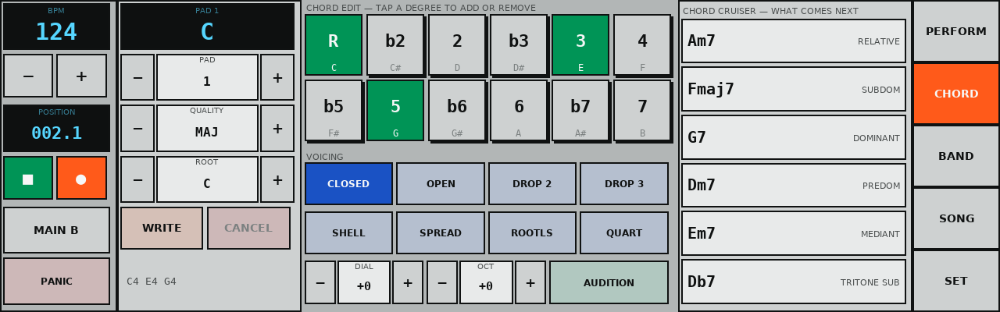
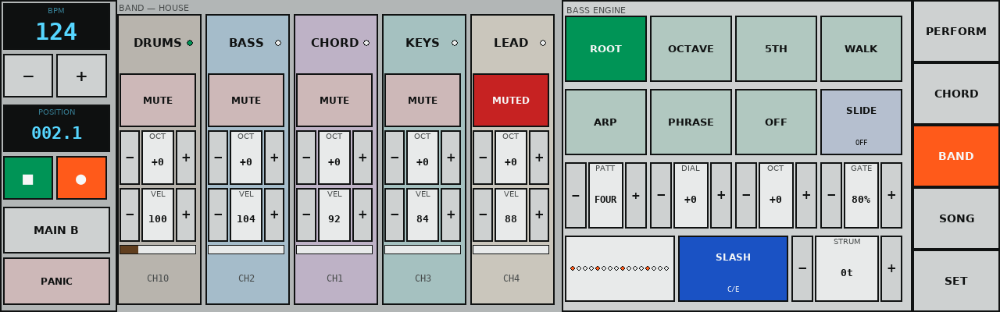
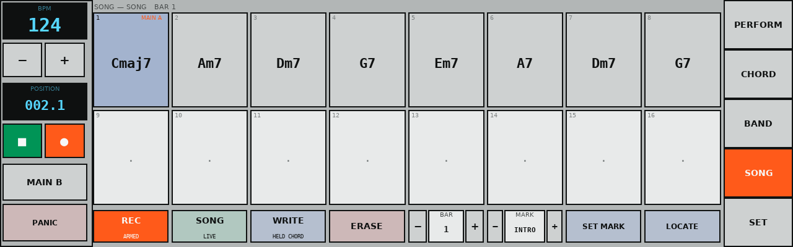
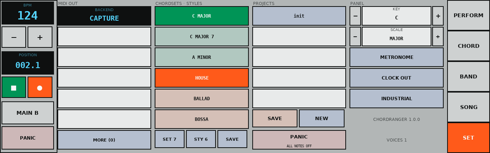

# ChordRanger — panel guide

The panel is 1280×400. Transport rail on the left, tabs on the right, one
screen in between. Everything is a touch target; nothing needs a keyboard.

---

## PERFORM


**The readout.** The big window is the chord in force. Next to it, NEXT is
where the song is going (blank when you are playing live, because nothing
knows). To the right: the key, the style, the chordset, and the section —
which shows `MAIN A ▸ FILL AB` in orange when a change is queued.

**The pads.** Twelve chords, six across and two down. Each shows its symbol
and, underneath, its roman numeral in the chordset's key — `ii` for a minor
supertonic, `V/V` for a secondary dominant, blank for a chord with no
relationship to the key. Pads are tinted by function:

| Colour | Function |
|--------|----------|
| green | tonic — I, iii, vi |
| blue | predominant — ii, IV |
| orange | dominant — V, vii°, and any secondary dominant |
| grey | borrowed, or outside the key |

Tap a pad and the band follows it. With the transport stopped it sounds the
chord on its own, so the box is an instrument and not only a sequencer.

**Hold a pad** for half a second to open it on the CHORD screen.

**The section buttons.** Left to right in the shape of an arrangement: INTRO,
MAIN A, FILL AB, MAIN B, FILL BA, ENDING. Pressing one while stopped starts
the band there. Pressing one while playing queues it for the next bar line —
and moving between the two mains routes through the matching fill on its own,
so you press the section you want rather than the fill that gets you there.
ENDING plays and stops the transport.

**LATCH** decides whether a chord holds after you lift your finger (HOLD) or
lasts exactly as long as the touch (GATE). **SONG** switches between playing
the written chord track and playing whatever you hold. **CRUISE** jumps to the
CHORD screen.

---

## CHORD



Three panels: what you are editing, the twelve degree keys, and the Cruiser.

**Left — the target.** Which pad you are on, its chord, and steppers for pad,
quality and root. WRITE commits the edit to the pad; CANCEL throws it away.
Edits are local until you press WRITE — half-built chords must not leak into a
performance, and the pad you are editing is very often the one you are
playing. The bottom line shows the notes the chord would actually send.

**Middle — Chord Edit.** Twelve keys, one per semitone above the root, labelled
by interval (`R b2 2 b3 3 4 b5 5 b6 6 b7 7`) with the concrete note underneath.
Lit keys are in the chord. Tap to add or remove. Pulling the root out is
allowed and is how you get the rootless voicings a keyboard player leaves to
the bass — the bass part still knows what the chord is called.

Below that, all eight voicings — CLOSED, OPEN, DROP 2, DROP 3, SHELL, SPREAD,
ROOTLESS, QUARTAL — plus two dials:

- **DIAL** is the voicing wheel: one detent moves exactly one note by one
  octave, walking the chord up through its inversions and back. The harmony
  never changes along the whole travel, which is what makes it safe to turn
  while a chord is sounding.
- **OCT** moves the whole voicing.

**Right — the Cruiser.** Six chords that could come next, ranked on function
(V wants I, ii wants V), voice-leading distance (chords that share notes
connect), and novelty (chords already on your pads are pushed down). The word
beside each says why it is offered. Tap one to try it.

---

## BAND



**Left — the mixer.** One strip per part: name, activity lamp, MUTE, octave,
velocity, a meter and the MIDI channel. The lamp is worth watching: when
nothing is coming out of the rig, a lit lamp with silence downstream tells you
the box is playing and the synth is not hearing it.

**Right — the bass engine.**

| Mode | What it plays |
|------|---------------|
| ROOT | the chord's bass note on every step of the pattern |
| OCTAVE | alternates root and root + 12 |
| 5TH | alternates root and fifth |
| WALK | a stepwise line through the chord tones that arrives on a leading tone into the next chord |
| ARP | runs up the chord tones |
| PHRASE | the style's own written bassline |
| OFF | silence, without thinning the chord part |

**PATT** picks the step pattern (FOUR, EIGHTS, PUSH, OFFBEAT, DISCO, REGGAE,
BOSSA, FUNK, DUB…), drawn as sixteen lamps below. **DIAL** walks the line one
chord tone at a time — down for a low fifth under the chord, up for an
inversion. **OCT** moves its register, **GATE** its note length. **SLIDE**
overlaps notes so a mono synth in legato mode glides between them. **SLASH**
decides whether `C/E` puts the bass on E or keeps it on C. **STRUM** spreads
the chord part's voices across a few ticks, turning a stab into a guitar
chord.

---

## SONG



Sixteen bars on screen. A bar where a chord was *written* shows its symbol; a
bar that inherits the chord shows a tie. Bars past the end of the song are
empty — that is where you write the next section.

The workflow is meant to be played, not typed:

1. **REC** to arm, then play — pad taps are written to the bar you are in,
   quantised to the downbeat.
2. Fix what you fluffed here: select a bar, hold the chord you want, **WRITE**.
   **ERASE** clears the change at the cursor.
3. **MARK** picks a section and **SET MARK** attaches it to the selected bar,
   so the form follows the tune.
4. **SONG** switches the transport between the written arrangement and live
   pad playing. **LOCATE** jumps there.

---

## SET



**MIDI OUT** shows the backend in force and the ports it can see. Tap a port
to bind it. If the backend says `NULL` in orange, the MIDI package is not
installed and the rig is silent by design rather than by fault — the panel
still works, and this is where it says so.

**CHORDSETS · STYLES** loads any of the shipped chordsets and styles; SET and
STY page through them, SAVE writes the live chordset to the data partition.

**PROJECTS** lists what is on the card, newest first. SAVE writes the current
one (tempo, chordset, style, song, voicing, bass — everything), NEW starts
over. PANIC kills every sounding note on every channel.

**PANEL** holds the key and scale (which set what the numerals and the
scale-conversion rule use), the metronome, MIDI clock out, the colourway, and
the version.

---

## The transport rail

Always visible, whichever screen you are on: tempo with ±, the bar/beat
readout, play/stop, record, the current section, and PANIC.

## The Button

| Gesture | Action |
|---------|--------|
| 1 click | play / stop |
| 2 clicks | record toggle |
| 3 clicks | next section the style actually has |
| hold ~1 s | save project |
| hold ~3 s | next style |
| hold ~5 s | panic |

Rebind under `[button.map]` in `/etc/chordranger/config.toml`. Actions:
`play_stop`, `record_toggle`, `next_section`, `prev_section`, `save_project`,
`next_style`, `next_chordset`, `panic`, `metronome`, `nothing`.

Diagnose it without a display:

```bash
chordranger-btn PING        # PONG means the instrument is listening
chordranger-btn --map       # the live gesture map
chordranger-btn --list      # every action name
chordranger-btn ACTION panic
```

If the instrument is not listening, `chordranger-btn` exits 2 and the Pisound
wrapper blinks the LEDs once and logs why — so a dead button has an
explanation in `journalctl -u pisound-btn` rather than being a mystery.
